<div align="center">

# 🗄️ IBM Z Xplore — PDS1: Files for Miles

### *Mastering Partitioned Data Sets on IBM Z Mainframe*

[](https://ibmzxplore.influitive.com/)
[](https://www.ibm.com/products/zos)
[](https://marketplace.visualstudio.com/items?itemName=Zowe.vscode-extension-for-zowe)
[](https://github.com)
[](https://github.com)

---

> **"On IBM Z, every byte matters — and I know exactly where each one lives."**

</div>

---

## 🧭 What Is This?

This repository documents my completion of **PDS1 — Files for Miles**, an advanced hands-on challenge from [IBM Z Xplore](https://ibmzxplore.influitive.com/). The challenge lives on a **real IBM Z mainframe system** accessed through Visual Studio Code and covers the fundamentals of one of the most critical data structures in enterprise computing: **Partitioned Data Sets (PDS)**.

If you've never heard of a mainframe — that's the engine quietly running your bank transactions, airline bookings, and government records, processing **over 30 billion transactions every day**. This challenge proves I can navigate that world confidently.

---

## 🤔 Why Should You Care? (Non-Technical Version)

Think of it this way:

> 🗂️ **Your PC** stores files in folders on your hard drive.
> 🏦 **IBM Z Mainframe** stores files in *Data Sets* — a smarter, faster, and far more secure version — designed to never lose data, even under the heaviest workloads on the planet.

This challenge taught me how to navigate, organize, copy, and process those enterprise-grade data files — skills that are rare, in high demand, and critical in banking, insurance, healthcare, and government IT.

---

## 🏗️ Technical Architecture

### What Is a Partitioned Dataset (PDS)?

A **Partitioned Dataset** is like a folder that contains multiple files (called **Members**). But unlike a regular computer folder, a PDS:

- Has a built-in **directory** (index) tracking every member
- Stores data in fixed **record formats**
- Lives on a named **volume** (storage device)
- Is identified by a **High Level Qualifier (HLQ)** — your unique namespace on the mainframe

```
ZXP.PUBLIC.INPUT          ← This is the PDS (like a folder)
    ├── PDSPART1           ← This is a Member (like a file)
    ├── PDSPART2
    └── PDS1CCAT
```

### z/OS Dataset Type Comparison

| Dataset Type | Best Used For | Access Style | Analogy |
|---|---|---|---|
| **PDS** (Partitioned) | Source code, JCL, config | Random by member | 📁 Folder with files |
| **PS** (Sequential) | Logs, batch output | Top-to-bottom | 📜 Scroll / tape |
| **VSAM** | Databases, indexes | Keyed / random | 🗃️ Filing cabinet |
| **GDG** (Generation) | Version history | Generational | 🗓️ Dated archives |
| **PDSE** (Extended) | Modern source libs | Random + larger | 📂 Upgraded folder |

---

## 🗺️ System Architecture Diagram

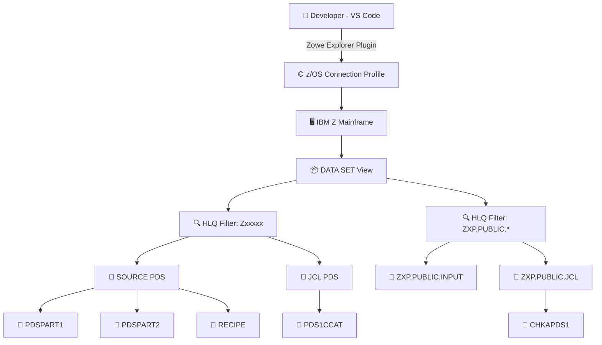

---

## ⚙️ End-to-End Workflow

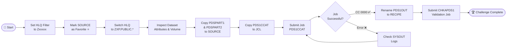

---

## 📋 Step-by-Step Walkthrough

### Step 1 — Set the Filter (HLQ) 🔍

The **High Level Qualifier** is like your username namespace on the mainframe. Setting a filter in VS Code tells it: *"Only show me datasets that belong to me."*

**What I did:** Clicked the magnifying glass icon in the DATA SETS panel → entered my Z-userid `Zxxxxx` → only my datasets appeared.

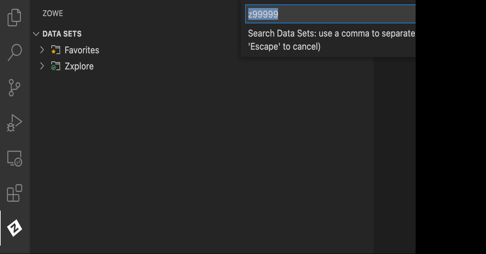

> 💡 **Why it matters:** On a real mainframe, there are thousands of datasets. The HLQ filter is your first layer of data access control — you only see what you're authorized to see.

---

### Step 2 — Mark Favorites ⭐

The VS Code Zowe Explorer lets you **star** frequently used datasets so they always appear at the top of your view.

**What I did:** Hovered over the `SOURCE` dataset → clicked the ⭐ star icon → it now appears pinned at the top.

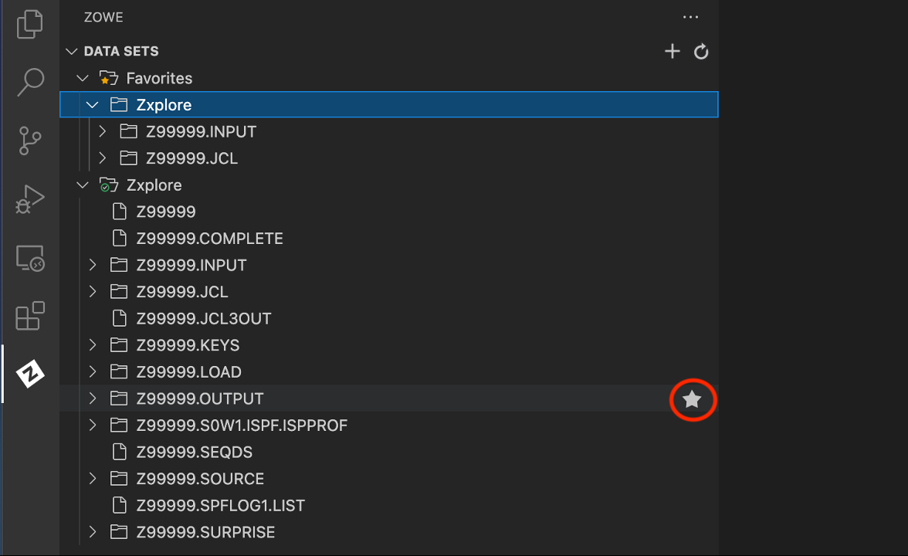

> 💡 **Why it matters:** In production mainframe work, you may have hundreds of datasets. Favorites are your productivity shortcut — like bookmarking the most critical system files.

---

### Step 3 — Switch HLQ & Locate Datasets 🗂️

Next, I switched my HLQ filter to `ZXP.PUBLIC.*` to browse pre-built public datasets provided by IBM Z Xplore.

**What I did:** Updated the filter → right-clicked a dataset to inspect its attributes → found the dataset on storage **volume `VPWRKD`**.

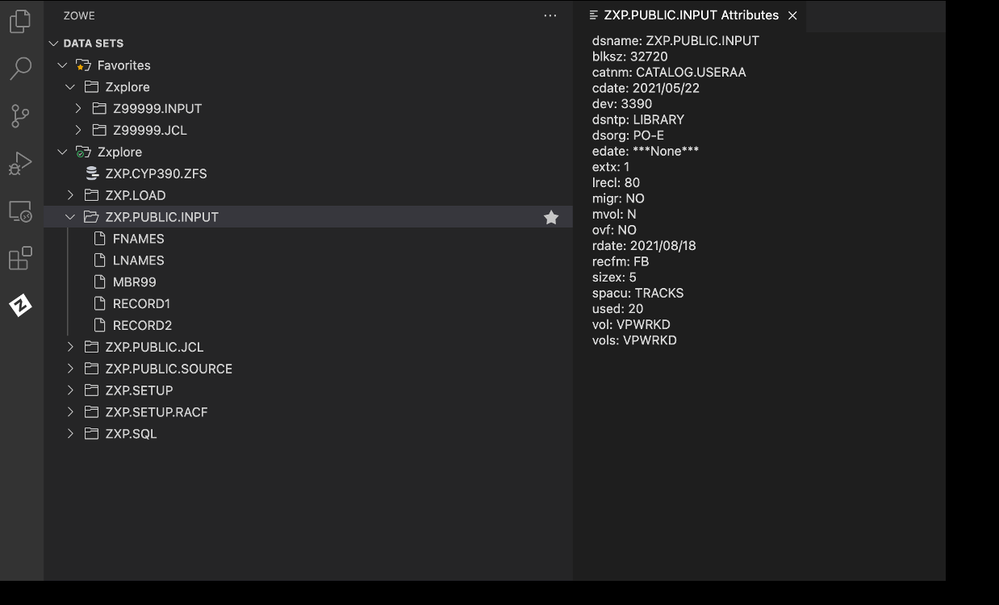

> 💡 **Why it matters:** On IBM Z, data lives on physical **volumes** (storage disks). Knowing which volume a dataset is on is essential for capacity planning, backup, and disaster recovery — skills that enterprise architects need daily.

---

### Step 4 — Copy & Paste Members 📋

This step mirrors what developers do constantly in mainframe teams: **copying source code members** from a shared library into your personal workspace.

**What I did:**
- Right-clicked `ZXP.PUBLIC.INPUT(PDSPART1)` → **Copy**
- Right-clicked my `SOURCE` dataset → **Paste** → kept the name `PDSPART1`
- Repeated for `PDSPART2`
- Copied `PDS1CCAT` from `ZXP.PUBLIC.JCL` into my `JCL` dataset

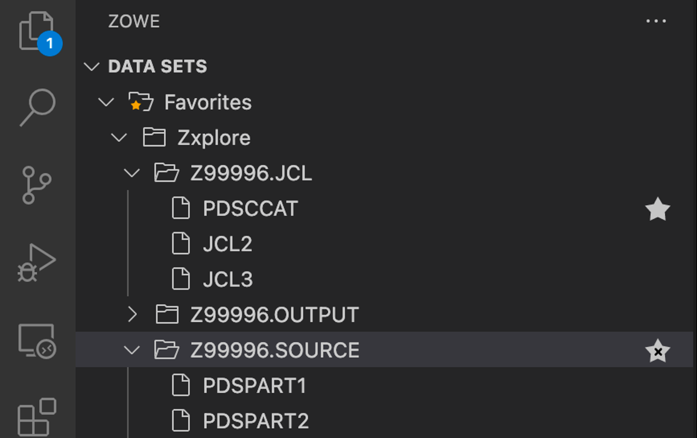

> 💡 **Why it matters:** This is exactly how real mainframe teams manage source code — developers pull from shared libraries (like a Git repository equivalent) into their personal datasets to test and modify.

---

### Step 5 — Run That Job! ⚡

A **JCL Job** (Job Control Language) is a script that tells the mainframe's operating system what to do — similar to a shell script or a CI/CD pipeline job.

**What I did:** Right-clicked `PDS1CCAT` in my JCL dataset → selected **"Submit Job"** → waited for the job to execute → a new member `PDS1OUT` appeared in my `SOURCE` dataset.

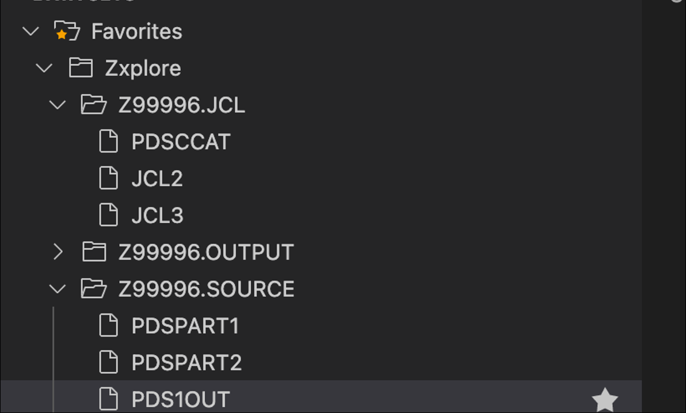

> 💡 **Why it matters:** JCL job submission is the heartbeat of mainframe operations. Every bank statement, payroll run, and insurance claim is processed by a JCL job. Running one successfully proves I understand the core execution model of IBM Z.

---

### Step 6 — Rename the Output 🏷️

The final step was renaming the job's output member from `PDS1OUT` to `RECIPE`, then running a validation job to confirm completion.

**What I did:** Right-clicked `PDS1OUT` → **Rename** → `RECIPE` → submitted the `CHKAPDS1` validation job → received **CC 0000** (Condition Code 0 = perfect success).

> 🎉 The `RECIPE` member contained instructions for making **vegetarian tacos** — a fun way IBM Z Xplore confirms you've successfully processed a data member!

---

## 🔐 Security Features & Concepts

This challenge, while introductory, demonstrates real enterprise-grade security concepts baked into z/OS:

| Security Feature | How It Works | Why It Matters |
|---|---|---|
| **HLQ Namespacing** | Each user has a unique HLQ (e.g., `Zxxxxx`) | Prevents accidental access to other users' data |
| **RACF Integration** | z/OS uses Resource Access Control Facility | Controls who can read, write, or delete any dataset |
| **Volume Isolation** | Data lives on named volumes (e.g., `VPWRKD`) | Physical separation of data sets |
| **Job Authorization** | Only authorized users can submit JCL jobs | Prevents unauthorized batch execution |
| **Condition Codes** | Jobs return codes (CC 0000 = success) | Auditable job execution trail |
| **Zowe Secure Connection** | VS Code connects via encrypted profile | TLS-secured mainframe communication |

---

## 🛠️ Tech Stack

| Component | Technology | Purpose |
|---|---|---|
| **IDE** | Visual Studio Code | Development environment |
| **Extension** | Zowe Explorer (IBM) | Mainframe connectivity |
| **Operating System** | IBM z/OS | Mainframe OS |
| **Data Structure** | Partitioned Dataset (PDS) | File organization on z/OS |
| **Job Language** | JCL (Job Control Language) | Batch job execution |
| **Connection Protocol** | z/OSMF / Zowe API | Secure REST-based mainframe access |
| **Storage** | Named Volumes (VPWRKD) | Physical data storage on IBM Z |
| **Validation** | Batch Job (CHKAPDS1) | Automated challenge verification |

---

## 📊 Challenge at a Glance

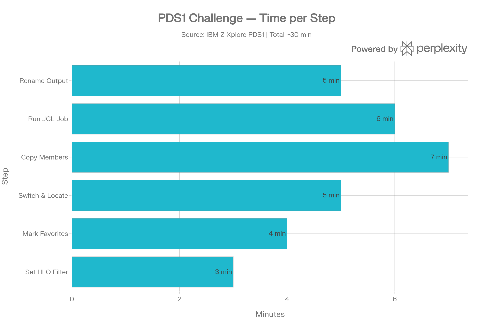

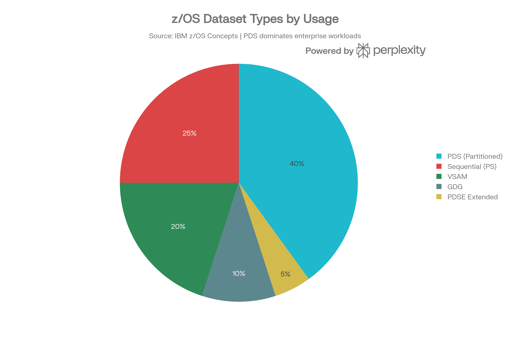

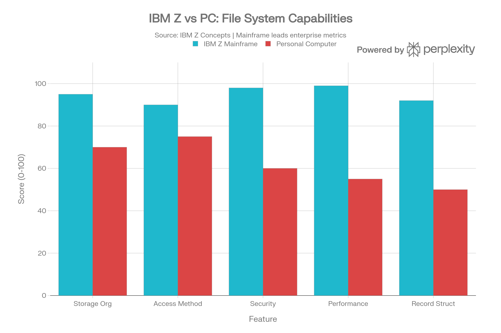

---

## 🔁 JCL Job Lifecycle

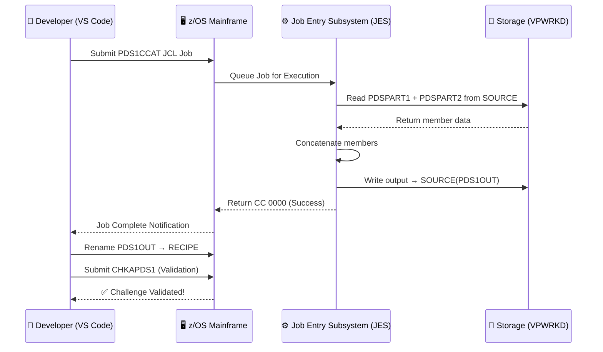

---

## 📐 Dataset Structure Deep Dive

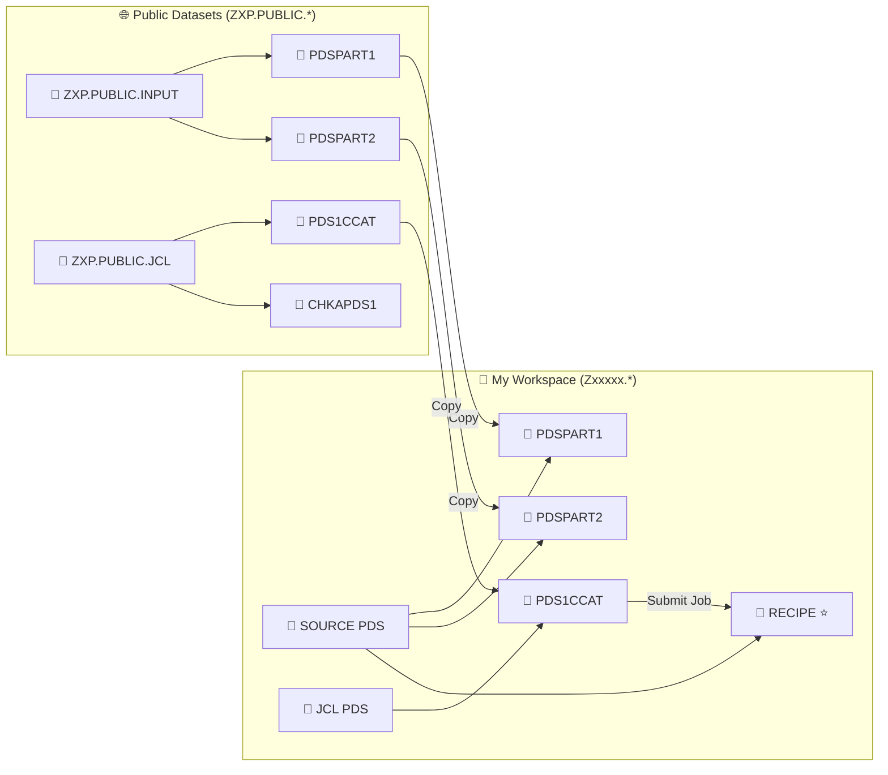

---

## 🧠 What I Learned (And Why You Should Hire Me)

After completing this challenge, I can confidently say:

- ✅ I understand how **IBM Z organizes enterprise data** at a structural level
- ✅ I can **navigate, copy, and manage PDS members** using modern tooling (VS Code + Zowe)
- ✅ I can **submit and monitor JCL batch jobs** — the lifeblood of mainframe workloads
- ✅ I understand **volume-based storage architecture** and dataset attributes
- ✅ I know how **security namespacing (HLQ + RACF)** protects mainframe data
- ✅ I bridge the gap between **modern developer tooling** and **legacy mainframe systems**

> 🌐 **The mainframe is not legacy — it's the invisible backbone of the global economy.**
> I'm one of the rare engineers who can work on both sides of that bridge.

---

## 🔗 Resources

- [IBM Z Xplore Learning Platform](https://ibmzxplore.influitive.com/)
- [Zowe Explorer for VS Code](https://marketplace.visualstudio.com/items?itemName=Zowe.vscode-extension-for-zowe)
- [IBM z/OS Dataset Documentation](https://www.ibm.com/docs/en/zos)
- [JCL Reference Guide](https://www.ibm.com/docs/en/zos/latest?topic=language-job-control)
- [IBM Z Skills Network](https://www.ibm.com/training/z)

---

<div align="center">

**Built with 🖤 on a real IBM Z Mainframe**

*IBM Z Xplore — PDS1 Challenge | Advanced Level | Completed ✅*

[](https://linkedin.com/in/anandsundar96)
[](https://github.com/anandsundar)

</div>
